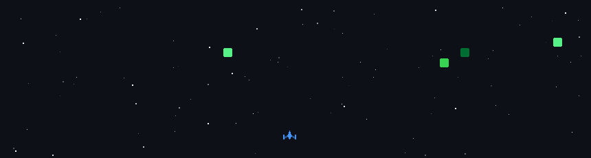

<h1 align="center">Hi 👋, I'm Prasath</h1>

Backend & AI-agent engineer — C#/.NET, Java, Kotlin, Go, and a lot of SQL.

  

### 🛠️ Tech

  
  
  
  
  
  
  
  
  
  
  
  

### 📦 Projects

- **[Alora Auth](https://github.com/prasath-23/Alora-Auth)** · `Go` — Multi-tenant B2B auth & SSO. OAuth2 + PKCE, RS256 JWTs with key rotation and JWKS, Argon2id, refresh-token reuse detection.
- **[Krypt](https://github.com/prasath-23/Krypt)** · `Kotlin` — Offline P2P Android app locker. Symmetric-key crypto and deep-link handshakes, with physical-presence onboarding.
- **[Sleep Apnea Detection](https://github.com/prasath-23/Sleep-apnea-detection)** · `Python` — Detects sleep apnea from a single-lead ECG with a modified 1D LeNet-5.

### 🤝 Connect

